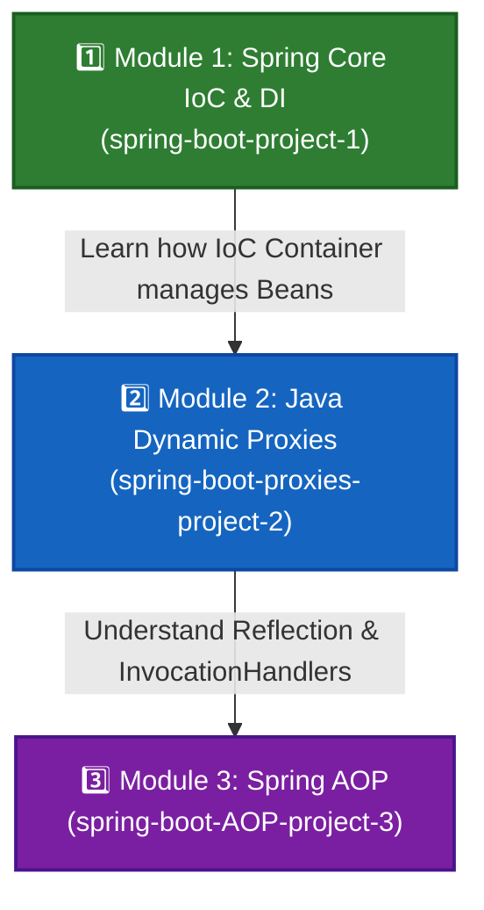

# 🍃 Spring Boot & Core Framework — Hands-on Study Repository

Welcome to the **Spring Boot Study Material Repository**! This repository is designed as a structured, step-by-step learning resource covering fundamental to advanced Spring Framework concepts, Java reflection mechanisms, and Aspect-Oriented Programming (AOP).

> [!NOTE]
> **Study Material Repo**: This is a dedicated learning repository containing modular project examples, conceptual notes, and Excalidraw architectural diagrams. It is structured progressively from Spring IoC basics to low-level Dynamic Proxies and Spring AOP.

---

## 📌 Table of Contents

- [🎓 Recommended Learning Roadmap](#-recommended-learning-roadmap)
- [📦 Learning Modules Summary](#-learning-modules-summary)
- [🗺️ Deep-Dive Module Navigation](#️-deep-dive-module-navigation)
  - [1. Spring Core IoC & Bean Configuration (`spring-boot-project-1`)](#1-spring-core-ioc--bean-configuration-spring-boot-project-1)
  - [2. Java Dynamic Proxies & Interception (`spring-boot-proxies-project-2`)](#2-java-dynamic-proxies--interception-spring-boot-proxies-project-2)
  - [3. Spring Aspect-Oriented Programming (`spring-boot-AOP-project-3`)](#3-spring-aspect-oriented-programming-spring-boot-aop-project-3)
- [🎨 Conceptual Diagrams & Excalidraw Notes](#-conceptual-diagrams--excalidraw-notes)
- [⚡ Spring AOP Advice Cheat Sheet](#-spring-aop-advice-cheat-sheet)
- [🚀 How to Run & Test Modules](#-how-to-run--test-modules)
- [🛠️ Tech Stack & Requirements](#️-tech-stack--requirements)

---

## 🎓 Recommended Learning Roadmap

To get the most out of this study material, follow this recommended sequence:



---

## 📦 Learning Modules Summary

| Module | Core Topic | Key Concepts Covered | Key Files / Entry Points | Visual Notes |
| :--- | :--- | :--- | :--- | :--- |
| [**`spring-boot-project-1`**](./spring-boot-project-1) | **Spring IoC & DI** | XML Bean Config, Setter & Constructor Injection, Factory Methods | [`applicationContext.xml`](./spring-boot-project-1/app/src/main/resources/applicationContext.xml)<br/>[`App.java`](./spring-boot-project-1/app/src/main/java/org/example/App.java) | [Diagram](./spring-boot-project-1/notes/notes.png) \| [Excalidraw](https://excalidraw.com/#json=1nqxfjjxhry0VVjISZqeb,XQuR08jPbyRGlewhpTPGWw) |
| [**`spring-boot-proxies-project-2`**](./spring-boot-proxies-project-2) | **Java Dynamic Proxies** | `java.lang.reflect.Proxy`, `InvocationHandler`, Interface Proxies | [`PersonInvocationHandler.java`](./spring-boot-proxies-project-2/app/src/main/java/org/example/classes/PersonInvocationHandler.java)<br/>[`App.java`](./spring-boot-proxies-project-2/app/src/main/java/org/example/App.java) | [Diagram](./spring-boot-proxies-project-2/Notes/note.png) \| [Excalidraw](https://excalidraw.com/#json=Qt6SxfWJ4XqnyniURvDvc,ONO2l34kanvI7Oe5XZlrMA) |
| [**`spring-boot-AOP-project-3`**](./spring-boot-AOP-project-3) | **Spring Boot AOP** | `@Aspect`, `@EnableAspectJAutoProxy`, `@Before`, `@After`, `@Around`, `@AfterThrowing`, `@AfterReturning`, `@Pointcut` | [`Logging.java`](./spring-boot-AOP-project-3/app/src/main/java/org/example/logging/Logging.java)<br/>[`API.java`](./spring-boot-AOP-project-3/app/src/main/java/org/example/restAPIs/API.java) | [Diagram](./spring-boot-AOP-project-3/Notes/Notes.png) \| [Excalidraw](https://excalidraw.com/#json=iH_GzDtvFvbYhZ9JpSW4m,4Q98c0DEsNWCuokG1n4_qQ) |

---

## 🗺️ Deep-Dive Module Navigation

### 1. Spring Core IoC & Bean Configuration (`spring-boot-project-1`)
Focuses on understanding Spring's **Inversion of Control (IoC) Container** and how dependencies are wired using XML configuration.

- **Directory**: [`./spring-boot-project-1`](./spring-boot-project-1)
- **Key Concepts Learned**:
  - Initializing `ApplicationContext` via `ClassPathXmlApplicationContext`.
  - **Setter Injection** using `<property name="..." value="..." />`.
  - **Constructor Injection** using `<constructor-arg ref="..." />`.
  - **Static Factory Method** bean instantiation using `factory-method="createInstance"`.

#### 📂 Important Locations & Source Code
- 📄 [XML Configuration: `applicationContext.xml`](./spring-boot-project-1/app/src/main/resources/applicationContext.xml) — Defines beans, property injections, constructor refs, and factory methods.
- ☕ [Main Entry Point: `App.java`](./spring-boot-project-1/app/src/main/java/org/example/App.java) — Boots the Spring Application Context and retrieves configured beans.
- ☕ [Bean Model: `UserConfig.java`](./spring-boot-project-1/app/src/main/java/org/example/bean/UserConfig.java) — Simple POJO bean holding user configuration properties.
- ☕ [Service: `UserService.java`](./spring-boot-project-1/app/src/main/java/org/example/service/UserService.java) — Service demonstrating Constructor Injection.
- ☕ [Service: `OrderService.java`](./spring-boot-project-1/app/src/main/java/org/example/service/OrderService.java) — Service initialized via static factory method.
- 🖼️ [Architectural Notes & Diagram](./spring-boot-project-1/notes) — Contains visual diagram screenshot and Excalidraw board.

```xml
<!-- Example Snippet: XML Bean Injections in applicationContext.xml -->
<bean id="userConfigBean" class="org.example.bean.UserConfig">
    <property name="name" value="Bishal Saha"/>
    <property name="className" value="ExampleClass"/>
</bean>

<bean id="userService" class="org.example.service.UserService">
    <constructor-arg ref="userConfigBean"/>
</bean>
```

---

### 2. Java Dynamic Proxies & Interception (`spring-boot-proxies-project-2`)
Explores **JDK Dynamic Proxies**, which form the fundamental mechanism used under the hood by Spring AOP to create proxy objects for cross-cutting concerns.

- **Directory**: [`./spring-boot-proxies-project-2`](./spring-boot-proxies-project-2)
- **Key Concepts Learned**:
  - Creating runtime proxy objects using `java.lang.reflect.Proxy`.
  - Implementing `InvocationHandler` to intercept method invocations.
  - Understanding interface-based proxying vs concrete implementation target execution.

#### 📂 Important Locations & Source Code
- ☕ [Main Entry Point: `App.java`](./spring-boot-proxies-project-2/app/src/main/java/org/example/App.java) — Constructs target instance and instantiates dynamic proxy using `Proxy.newProxyInstance(...)`.
- ☕ [Invocation Handler: `PersonInvocationHandler.java`](./spring-boot-proxies-project-2/app/src/main/java/org/example/classes/PersonInvocationHandler.java) — Custom handler intercepting target method calls.
- ☕ [Interface Contract: `Person.java`](./spring-boot-proxies-project-2/app/src/main/java/org/example/classes/Person.java) — Target interface with methods (`introduce`, `sayAge`, `sayWhereFrom`).
- ☕ [Concrete Implementation: `Man.java`](./spring-boot-proxies-project-2/app/src/main/java/org/example/classes/Man.java) — Implementation class being proxied.
- 🖼️ [Architectural Notes & Diagram](./spring-boot-proxies-project-2/Notes) — Dynamic proxy flow visualization.

```java
// Example Snippet: Creating a JDK Dynamic Proxy
Man target = new Man("Mohan", 30, "Delhi", "India");
Person proxy = (Person) Proxy.newProxyInstance(
    target.getClass().getClassLoader(),
    target.getClass().getInterfaces(),
    new PersonInvocationHandler(target)
);
proxy.introduce(target.getName());
```

---

### 3. Spring Aspect-Oriented Programming (`spring-boot-AOP-project-3`)
Covers full **Spring Boot AOP integration**, allowing clean separation of cross-cutting concerns (logging, exception handling, monitoring) without cluttering business logic.

- **Directory**: [`./spring-boot-AOP-project-3`](./spring-boot-AOP-project-3)
- **Key Concepts Learned**:
  - Enabling AspectJ Proxying with `@EnableAspectJAutoProxy`.
  - Defining Aspects using `@Aspect` and registering them as Spring components (`@Component`).
  - Using Pointcut Expressions (`@Pointcut("execution(...)")`) and combining them with boolean operators (`||`, `&&`).
  - Applying all 5 AOP Advice types (`@Before`, `@After`, `@Around`, `@AfterThrowing`, `@AfterReturning`).
  - Triggering Aspect advice dynamically from Spring Web `@RestController` endpoints.

#### 📂 Important Locations & Source Code
- ☕ [Aspect Class: `Logging.java`](./spring-boot-AOP-project-3/app/src/main/java/org/example/logging/Logging.java) — Comprehensive aspect demonstrating all advice types and reusable pointcut definitions.
- 🌐 [REST Controller: `API.java`](./spring-boot-AOP-project-3/app/src/main/java/org/example/restAPIs/API.java) — Controller defining `/login` and `/logout` web endpoints that invoke service methods.
- ☕ [Service Class: `UserService.java`](./spring-boot-AOP-project-3/app/src/main/java/org/example/service/UserService.java) — Target service class containing `logIn()` and `logOut()` (throws exception).
- ☕ [Application Main: `App.java`](./spring-boot-AOP-project-3/app/src/main/java/org/example/App.java) — Spring Boot Application annotated with `@EnableAspectJAutoProxy`.
- 🖼️ [Architectural Notes & Diagram](./spring-boot-AOP-project-3/Notes) — Spring AOP execution flow diagram.

```java
// Example Snippet: Pointcut & Reusable Advice in Logging.java
@Pointcut("execution(public * org.example.service.UserService.*(..))")
public void pointCut() {}

@Before("pointCut()")
public void loggingAdvice() {
    System.out.println("Before advice using pointcut is executed");
}
```

---

## 🎨 Conceptual Diagrams & Excalidraw Notes

Each study module includes visual diagrams and Excalidraw canvas links for quick revision and deep understanding:

| Module | Diagram Preview | Interactive Excalidraw Board | Description |
| :--- | :--- | :--- | :--- |
| **Module 1 (IoC)** | [🖼️ View Diagram](./spring-boot-project-1/notes/notes.png) | 🎨 [Open Excalidraw Board](https://excalidraw.com/#json=1nqxfjjxhry0VVjISZqeb,XQuR08jPbyRGlewhpTPGWw) | IoC Container architecture & bean dependency injection flow. |
| **Module 2 (Proxies)** | [🖼️ View Diagram](./spring-boot-proxies-project-2/Notes/note.png) | 🎨 [Open Excalidraw Board](https://excalidraw.com/#json=Qt6SxfWJ4XqnyniURvDvc,ONO2l34kanvI7Oe5XZlrMA) | JDK Dynamic Proxy interception mechanism & InvocationHandler. |
| **Module 3 (AOP)** | [🖼️ View Diagram](./spring-boot-AOP-project-3/Notes/Notes.png) | 🎨 [Open Excalidraw Board](https://excalidraw.com/#json=iH_GzDtvFvbYhZ9JpSW4m,4Q98c0DEsNWCuokG1n4_qQ) | Spring AOP Advice execution lifecycle & AspectJ proxying. |

---

## ⚡ Spring AOP Advice Cheat Sheet

| Advice Annotation | When Executed | Typical Use Case |
| :--- | :--- | :--- |
| `@Before` | Before the target method execution | Authorization checks, request validation, pre-logging |
| `@After` | After the target method returns or throws an exception | Cleanup resources, audit logging |
| `@Around` | Wraps method call (runs *before* and *after*) | Performance execution timing, transaction management |
| `@AfterReturning` | Only after target method completes **successfully** | Result logging, post-processing returned data |
| `@AfterThrowing` | Only when target method throws an **exception** | Centralized error logging, alerting, exception handling |

---

## 🚀 How to Run & Test Modules

Ensure you have **Java 17+** installed. You can build and run each module independently using the included Gradle Wrapper (`gradlew` / `gradlew.bat`).

### Running Module 1 (Spring Core IoC)
```bash
cd spring-boot-project-1
./gradlew run
```

### Running Module 2 (Java Dynamic Proxies)
```bash
cd spring-boot-proxies-project-2
./gradlew run
```

### Running Module 3 (Spring Boot AOP Web Server)
```bash
cd spring-boot-AOP-project-3
./gradlew bootRun
```
Once the server starts on `http://localhost:8080`, test the endpoints:
```bash
# Test /login endpoint (triggers @Before, @Around, etc.)
curl http://localhost:8080/login

# Test /logout endpoint (triggers @AfterThrowing exception advice)
curl http://localhost:8080/logout
```

---

## 🛠️ Tech Stack & Requirements

- **Language**: Java 17+
- **Framework**: Spring Boot, Spring Context, Spring Web, Spring AOP
- **AOP Framework**: AspectJ (`@EnableAspectJAutoProxy`)
- **Build Tool**: Gradle (with Gradle Wrapper included)
- **Utilities**: Lombok, Excalidraw

---

<p align="center">
  <i>Happy Learning! 🚀 Master Spring Core, Dynamic Proxies & Spring AOP!</i>
</p>
